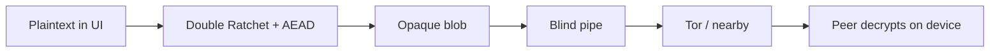
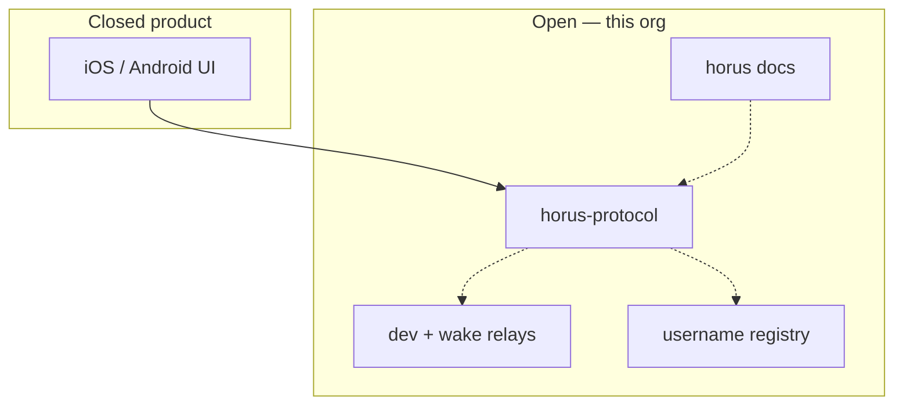

# Horus

**A private line.**

No phone number. No cloud account. No feed.

Horus is a sealed channel between you and the people you invite. Encryption happens on the phone. What leaves the device is an opaque blob. Relays never see the words, photos, files, or call audio inside.

**Website:** [horus.a10x.eu](https://horus.a10x.eu) — product story, privacy, support  
**Docs hub:** [horus-chat/horus](https://github.com/horus-chat/horus) — architecture, protocol, threat model  
**Protocol:** [horus-chat/horus-protocol](https://github.com/horus-chat/horus-protocol) — open Rust reference + `horus.h`

---

## What it is

Horus is a messenger for people who do not want to be found by a phone number, or stored on someone else’s server.

Mainstream apps trade convenience for a **graph**: SIM, email, a cloud inbox, a backup they can see or subpoena. Horus takes the other side of that trade.

| You get | What that means |
|---------|-----------------|
| **No signup** | Identity is a key on this install — not email, not SIM, not a cloud user id |
| **Burnable invites** | Link, QR, or nearby Bluetooth. They join. You accept. The invite is spent |
| **Sealed on device** | Encrypt before the network. Only the peer session can open it. We cannot |
| **Tor in the path** | The app runs Tor itself. Onion mailboxes — not a Horus clearnet chat API |
| **Forward secret** | Signal-style Double Ratchet + post-quantum hybrid on the invite handshake |
| **Quiet by default** | Optional wake pings carry **no preview** — not the name, not the text |

It ships as native **iOS** and **Android** apps sharing one protocol. There is **no** Horus message server. Nothing from a chat is written on a blockchain. There is no public directory of who talks to whom.

---

## What it is not

| Not this | Why it matters |
|----------|----------------|
| A social network | No public profile for messaging, no “people you may know,” no phone-number graph |
| A blockchain messenger | Optional `@` is a commitment lock — **not** where chats live |
| WhatsApp / Telegram / iMessage | Delivery needs Tor (or a trusted nearby hop). Notifications are best-effort |
| A recovery service | Lose the phone or wipe the app — the keys go with it. We cannot reset you |

Do not treat Horus as a pager. Focus modes, Low Power, or force-quit can delay wake. If the app is dead and wake is off, mail waits until you open it again.

---

## How you start

1. Install (store when listed) or build a client against the open protocol.  
2. First launch creates keys locally and asks for a **display name** — a label on your phone, not a Horus account.  
3. Tor boots inside the app. The first time can take several minutes. Later launches reuse cache.  
4. Create or redeem a one-time invite → **Accept** → Double Ratchet session. That is the whole handshake. There is no “add friend by phone number” after that.

Treat an unused invite like a secret. Anyone with the link can try to join until you accept, it expires, or it burns.

Nearby Bluetooth is a different confirmation: you both see a short code. Matching that code is the human check. Remote link/QR still use Accept, because you cannot see the other person in the room.

Deep walkthrough: [Message flow](https://github.com/horus-chat/horus/blob/main/docs/message-flow.md) · [Getting started](https://github.com/horus-chat/horus/blob/main/docs/getting-started.md)

---

## How messages move

Encryption and transport are separate jobs.

In production the pipe is an **onion mailbox** published by Tor running **inside** the app — not Orbot, not a VPN we sell, not a Horus datacenter holding plaintext.

There is no central inbox we operate. Both sides send and fetch sealed mail over Tor. If the path is down, the app keeps an **outbox** on the phone and flushes when it can. You can type offline.

We cannot push the message body through Apple or Google. **We do not have it.** Optional wake only asks their OS for a content-free ping so the app can fetch and decrypt locally.

---

## How it works — three planes

| Plane | Job | Where it runs |
|-------|-----|---------------|
| **Cryptography** | Seal / open payloads; ratchet session keys | On the phone, in [horus-protocol](https://github.com/horus-chat/horus-protocol) |
| **Transmission** | Move opaque blobs; never interpret them | Embedded Tor; optional local Bluetooth |
| **Discovery** | Optional `@` so someone who knows the name can find an invite | Public commitment registry — **not** the chat |

### Cryptography

- Identity on first launch: X25519 + ML-KEM for the invite  
- After Accept: Double Ratchet + ChaCha20-Poly1305 (Signal-shaped forward secrecy / PCS)  
- Groups: sealed fan-out among members who already have 1:1s — **no** Horus group server (MLS not shipped)  
- At rest: platform keystore / Keychain-backed ciphertext on device  

### Transmission

| Path | When | Carries |
|------|------|---------|
| Hybrid bridge | Default on official builds | AEAD ciphertext |
| Local outbox | Path down | Sealed frames waiting on device |
| Nearby Bluetooth | Optional pairing / sealed hop | Invite chunks or already-sealed payloads |
| Wake ping | Optional | Generic OS banner — never the message |

Calls use the same sealed path, not a clearnet WebRTC meeting room.

### On-chain locks (optional)

The chain is **not** the messenger. It can lock a name so it is unique and resolvable to a **new invite**, without publishing `username → encryption key`.

| Registry may hold | It does not hold |
|-------------------|------------------|
| Commitment that a name is taken | Your onion, device, or chats |
| Findable invite blob (if you chose findable) | A scrapeable pubkey directory |
| Install-scoped anti-squat lock | Your IP or advertising id |

Renaming `@` does not move or delete existing sessions. Threads are invite sessions, not usernames.

---

## Open source layout

Official **UI apps are closed**. Everything that defines *how Horus works* is open for review and alternate clients:

| Repository | Role |
|------------|------|
| **[horus](https://github.com/horus-chat/horus)** | Documentation hub (start here for depth) |
| **[horus-protocol](https://github.com/horus-chat/horus-protocol)** | Rust protocol + public C API |
| **[horus-dev-relay](https://github.com/horus-chat/horus-dev-relay)** | Local HTTP mailbox for labs / tests |
| **[horus-wake-relay](https://github.com/horus-chat/horus-wake-relay)** | Content-free APNs/FCM wake host |
| **[horus-username-registry](https://github.com/horus-chat/horus-username-registry)** | `@` commitments (ICP + Rust helpers) |

---

## Trust boundaries

| Trusted with plaintext | Not trusted with plaintext |
|------------------------|----------------------------|
| Keys, UI, history on the two phones | Tor relays |
| `horus-protocol` on device | Handle registry |
| Tor process on device (for anonymity toward the network) | Wake host |

A compromised phone is game over for that user. Tor raises the cost of watching you; it is not magic against a well-resourced adversary watching both ends for a long time. Timing and volume can still leak that *something* is moving.

**Horus has not had an independent security audit.** Do not treat it as “production hardened” in the insured, reviewed sense. Limits are listed on purpose: [threat model](https://github.com/horus-chat/horus/blob/main/docs/security-threat-model.md).

---

## Read next

| If you want… | Go here |
|--------------|---------|
| Product voice & privacy | [horus.a10x.eu](https://horus.a10x.eu) |
| Full technical docs | [horus-chat/horus](https://github.com/horus-chat/horus) |
| Clone & run tests | [Getting started](https://github.com/horus-chat/horus/blob/main/docs/getting-started.md) |
| Invite → chat narrative | [Message flow](https://github.com/horus-chat/horus/blob/main/docs/message-flow.md) |
| Crypto details | [Encryption](https://github.com/horus-chat/horus/blob/main/docs/encryption.md) |
| FFI for integrators | [FFI reference](https://github.com/horus-chat/horus/blob/main/docs/ffi.md) |

Report vulnerabilities via [SECURITY.md](https://github.com/horus-chat/horus/blob/main/SECURITY.md) in the docs repo.

License for open components: **MIT**.
